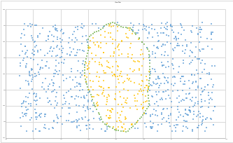

# Test Task


## Task description
Develop a Flask Blueprint to find the distance from the Moscow Ring Road to the 
specified address. The address is passed to the application in an HTTP request, 
if the specified address is located inside the MKAD, the distance does not need 
to be calculated. Add the result to the .log file 

To calculate the distance between points, we suggest using the Yandex Geocoder 
API https://yandex.ru/dev/maps/geocoder/doc/desc/concepts/about.html 

The developer key can be obtained for free upon registration. 


## Reqirements
Python 3.8 or later.

## Install
```
pip install Flask
pip install haversine
pip install numpy
```
After installation of the above packages the app can be started:

```
python src/main.py
```

After that address can be passed via HTTP POST request in JSON format:
```
POST / HTTP/1.1
Content-Type: application/json
Content-Length: 23
{"address": "Budapest"}
```
If the request was successful, the app will reply with an empty 204.
If the body is missing or has invalid content, the app will send 400 error 
response.

For geocoding I used the [position stack API](https://positionstack.com/). The limitation of this API is that 250 requests/month is allowed for free.

## Testing

The unit tests can be found in the test.py file.

For the testing of the function inside_mkad(), I generated random points in the range of the minimum and maximum latitude and an extended range of longitude (extended with the maxmimum - minimum of longitude) and exported the results to csv, so that it can be visualized easily.

